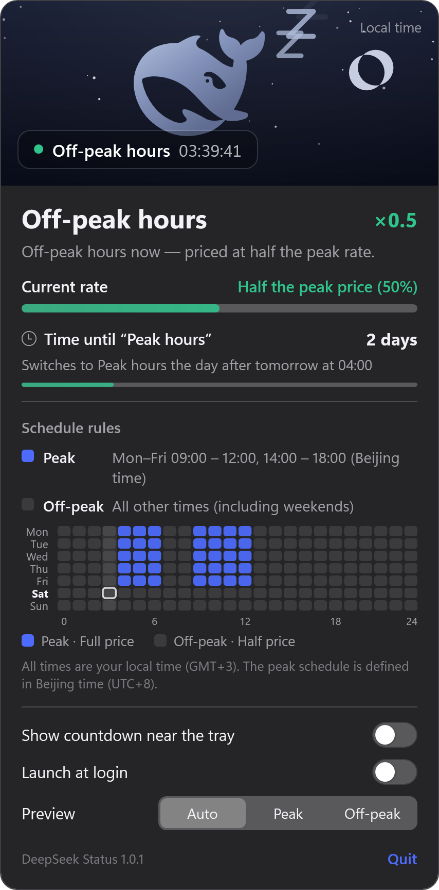

# 🐳 DeepSeek Status — Windows port

A native Windows port of [owenzhao/DeepSeekStatus](https://github.com/owenzhao/DeepSeekStatus):
a tiny system-tray app that tells you — at a glance — whether DeepSeek is in peak or off-peak
pricing.

The whale lives in the notification area:

- 🔵 **Peak hours** — a bright, tilted whale with bubbles trailing behind its tail.
- 😴 **Off-peak hours** — a pale, sleepy whale with little `z`s floating above it.

**Left-click** the whale for the full panel. **Right-click** for the quick menu.

## Screenshot

Off-peak hours — the whale sleeps, and every time is shown in the machine's local time
(here the Beijing schedule has been converted to GMT+3, so the peak blocks land at
04:00–07:00 and 09:00–13:00):



## Features

| Action | What happens |
| --- | --- |
| **Left-click** the tray whale | Open / close the details panel |
| **Right-click** the tray whale | Quick menu: preview peak, preview off-peak, follow live time, show countdown, launch at login, project page, quit |
| **Preview** picker in the panel | Force the app to *display* peak or off-peak; it never changes the real pricing |
| **Show countdown near the tray** | Adds a small `HH:MM:SS` pill next to the notification area (off by default). It is always-on-top and can be dragged; click it to open the panel |
| **Launch at login** | Registers the app under `HKCU\...\CurrentVersion\Run` (off by default) |
| **Quit** | Quits the app |

The panel contains the current period and price multiplier (`×1.0` / `×0.5`), the current-rate
bar, a live countdown to the next switch with block progress, and a 7×24 weekly schedule heat map
(blue = peak, gray = off-peak, with the current hour outlined), all rendered with the same
DeepSeek whale vector as the macOS original.

All times are converted to **your PC's local time zone** automatically: the aquarium clock, the
"switches to … at …" line, and the weekly heat map all show local hours. The underlying billing
rule stays anchored to Beijing time (UTC+8), which is what DeepSeek actually charges by.

The UI is English by default and switches to Simplified Chinese when Windows is set to Chinese
(`DEEPSEEK_STATUS_LANG=zh` or `DEEPSEEK_STATUS_LANG=en` can override it).

## Pricing rule

Off-peak pricing is half of peak pricing. Peak hours are **Monday–Friday 09:00–12:00 and
14:00–18:00, Beijing time**. Everything else is off-peak.

Details (identical to the macOS app):

- Ranges are **half-open**: 12:00 sharp is already off-peak, 18:00 sharp is already off-peak,
  and 09:00 sharp is already peak.
- The decision is **always made in Beijing time** (`UTC+8`, no daylight saving), regardless of
  your PC's time zone — that is the price that is actually billed. Every time the app *displays*
  (clock, countdown detail, weekly heat map) is converted to your local time zone, DST included.
  For example, 09:00 Beijing is 04:00 in Athens (UTC+3) and 21:00 the previous day in New York
  (UTC-4), and the heat map shifts accordingly.
- Only the weekday and the time of day are used. Chinese public holidays are **not** part of the
  rule.

## Requirements

- Windows 10 1809 or later / Windows 11.
- To build: [.NET 10 SDK](https://dotnet.microsoft.com/download) (Windows Desktop workload).
- To run a published build: .NET 10 Desktop Runtime.

## Build & run

```powershell
git clone <this repository>
cd dsstatus

.\build.ps1 run            # Debug build and launch
.\build.ps1                # Debug build only
.\build.ps1 -Configuration Release
.\build.ps1 -SelfTest      # run the pricing/geometry self-test in the console
.\build.ps1 -Publish       # self-contained single-file exe + zip in Build\ (no .NET runtime needed)
.\build.ps1 -Publish -Runtime win-arm64
```

Publishing is entirely local — no CI service is involved (and no GitHub Actions minutes are
consumed). `-Publish` runs `dotnet publish --self-contained true -p:PublishSingleFile=true`,
so `Build\DeepSeekStatus-<version>-win-x64.zip` just unzips and runs on any 64-bit Windows
machine, even without the .NET Desktop Runtime installed. Building from source only needs the
.NET 10 SDK.

The executable lands in `src\DeepSeekStatus\bin\<Configuration>\net10.0-windows\DeepSeekStatus.exe`.

There is no installer and no Dock/taskbar button: the app is tray-only
(`ShutdownMode=OnExplicitShutdown`, `ShowInTaskbar=false`).

Development helpers (same idea as the macOS `DEEPSEEK_STATUS_*` variables):

- `DEEPSEEK_STATUS_PREVIEW=peak|offPeak` — force the rendered period at startup.
- `DEEPSEEK_STATUS_COUNTDOWN=1` — force the countdown pill on at startup.
- `DEEPSEEK_STATUS_SHOW_PANEL=1` — open the panel right after startup (used for testing).
- `DEEPSEEK_STATUS_LANG=zh|en` — override the UI language.
- `DeepSeekStatus.exe --export-icons <dir>` — render `app.ico` and tray-icon PNGs.
- `DeepSeekStatus.exe --export-panel <dir>` — render the panel itself to a 2× PNG (used for `Preview/`).
- `DeepSeekStatus.exe --selftest` — run the built-in checks.

## Differences from the macOS original

- The menu bar item becomes a `NotifyIcon` in the notification area. Windows tray icons are
  square and cannot host a text label, so the "countdown in the menu bar" option is implemented
  as a small always-on-top pill that sits immediately left of the notification area instead
  (drag it if you want it elsewhere).
- Sparkle auto-update is not ported. The quick menu has **Project page…** which opens the
  upstream repository instead.
- Launch-at-login uses the per-user `Run` registry key rather than `SMAppService`.
- Times in the panel are shown in your local time zone instead of Beijing time (the macOS
  original always displayed Beijing time). The billing logic itself is unchanged.
- Everything else — the pricing math, half-open Beijing-time ranges, countdown, progress bars,
  weekly heat map, preview banner, whale vector, palette and the "no network" behavior — is a
  direct port of the Swift sources in `DeepSeekStatus/` (see the `DeepSeekStatus-macos`
  reference checkout).

## Privacy

The app never touches the network. There is no analytics, no update check, no API key and no
account. It reads the local clock, draws a whale, and that's it. The only system state it writes
is the optional `Run` registry value for launch-at-login and the small `HKCU\Software\DeepSeekStatus`
preference key.

## License

[MIT](LICENSE) © 2026 Zhao Xin — Windows port by the DeepSeek Status contributors.

The whale is the official DeepSeek mark, taken from the [Simple Icons](https://simpleicons.org)
collection (CC0). "DeepSeek" and its logo belong to their owner. This project is an unofficial
utility and is not affiliated with or endorsed by DeepSeek.
